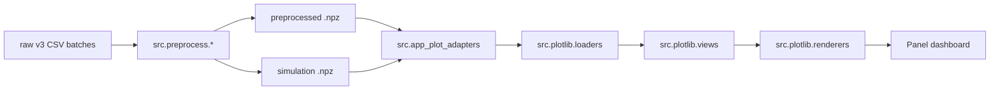

# `src.plotlib` Architecture

## End-to-end flow

`src.plotlib` sits between preprocess outputs and the dashboard.

`src.plotlib` does not handle:

- raw data scanning
- dataset catalog construction
- preprocess execution
- simulation execution

Those responsibilities stay in:

- `src.preprocess.catalog`
- `src.preprocess.service`
- `src.simulation.service`
- `gui/plot.py`

## Layers

### 1. Public facade

[`src/plotlib/views.py`](/C:/Users/tedhu/Desktop/prog/python/Quantitative_Finance/src/plotlib/views.py)

Responsibilities:

- expose stable builder names for app code
- defer imports of renderer implementations
- hide `renderers/` file layout from callers

This keeps app code independent from renderer module names and makes renderer refactors cheaper.

### 2. Schema, options, and errors

Modules:

- [`src/plotlib/types.py`](/C:/Users/tedhu/Desktop/prog/python/Quantitative_Finance/src/plotlib/types.py)
- [`src/plotlib/options.py`](/C:/Users/tedhu/Desktop/prog/python/Quantitative_Finance/src/plotlib/options.py)
- [`src/plotlib/errors.py`](/C:/Users/tedhu/Desktop/prog/python/Quantitative_Finance/src/plotlib/errors.py)

Responsibilities:

- define payload contracts
- define render-option contracts
- define plotlib-specific exceptions

### 3. Loaders

Modules:

- [`src/plotlib/loaders/orderbook.py`](/C:/Users/tedhu/Desktop/prog/python/Quantitative_Finance/src/plotlib/loaders/orderbook.py)
- [`src/plotlib/loaders/trades.py`](/C:/Users/tedhu/Desktop/prog/python/Quantitative_Finance/src/plotlib/loaders/trades.py)
- [`src/plotlib/loaders/simulation.py`](/C:/Users/tedhu/Desktop/prog/python/Quantitative_Finance/src/plotlib/loaders/simulation.py)

Responsibilities:

- convert `.npz` files into normalized `V1` payloads
- perform basic required-key checks
- normalize dtypes before rendering

They intentionally do not handle:

- GUI interactions
- dataset capability checks
- plot-type selection

Those belong in the app layer.

### 4. Renderers

Modules:

- `renderers/orderbook.py`
- `renderers/trades_scatter.py`
- `renderers/trade_volume_timeline.py`
- `renderers/fill_probability.py`
- `renderers/profit_heatmap.py`
- `renderers/cost_fill_probability.py`
- `renderers/trades_common.py`
- `renderers/simulation_common.py`

Responsibilities:

- accept schema-normalized payloads
- merge data if needed
- bin and aggregate data
- build the final plotting objects

## Orderbook renderer

Orderbook is the only renderer that uses `holoviews + datashader`.

Why:

- orderbook depth is a large matrix and benefits from rasterization
- the view needs range-aware slicing while zooming

Implementation highlights:

1. `_normalize_payload()` validates schema version and converts raw volume to signed log scale.
2. `_merge_payloads()` aligns multiple payloads onto a common `price_axis`.
3. time gaps between batches get a `NaN` separator column
4. `RangeXY` and `DynamicMap` limit rendering to the visible viewport
5. bid, ask, and mid lines are overlaid on top of the heatmap

## Trades renderers

Trades plots use `plotly`.

Shared logic is centralized in [`src/plotlib/renderers/trades_common.py`](/C:/Users/tedhu/Desktop/prog/python/Quantitative_Finance/src/plotlib/renderers/trades_common.py):

- accept either `TradesPayloadV1` or `pandas.DataFrame`
- enforce a single `product_id`
- merge batches and sort by time

The two views differ only in presentation:

- `trades_scatter`: price on the y-axis, marker size scaled by volume
- `trade_volume_timeline`: overlayed bars split by trade side

## Simulation renderers

All simulation plots use `plotly` heatmaps and share utilities in [`src/plotlib/renderers/simulation_common.py`](/C:/Users/tedhu/Desktop/prog/python/Quantitative_Finance/src/plotlib/renderers/simulation_common.py).

Shared utilities include:

- linear and log bin edges
- heatmap trace creation
- shared sample-count scale selection
- square-axis configuration

### Fill probability

Source: [`src/plotlib/renderers/fill_probability.py`](/C:/Users/tedhu/Desktop/prog/python/Quantitative_Finance/src/plotlib/renderers/fill_probability.py)

Logic:

- 2D binning over `near_size` and `opp_size`
- `result == 1` counts as fill
- `fill_count / total_count` produces the probability grid
- the second row shows sample count

### Profit heatmap

Source: [`src/plotlib/renderers/profit_heatmap.py`](/C:/Users/tedhu/Desktop/prog/python/Quantitative_Finance/src/plotlib/renderers/profit_heatmap.py)

Logic:

- only filled orders contribute, meaning `result == 1`
- each cell shows average profit
- the color scale is symmetric around zero

### Cost-filtered fill probability

Source: [`src/plotlib/renderers/cost_fill_probability.py`](/C:/Users/tedhu/Desktop/prog/python/Quantitative_Finance/src/plotlib/renderers/cost_fill_probability.py)

Logic:

- first filter by `profit > cost`
- then compute fill probability and sample count
- raises immediately if `render_options.cost` is missing

## App-layer integration

### Plot registry

[`src/app_plot_registry.py`](/C:/Users/tedhu/Desktop/prog/python/Quantitative_Finance/src/app_plot_registry.py) stores:

- plot id
- UI label
- UI group
- required payload type
- dataset support rules

This registry is not part of `src.plotlib`, but it is the main bridge between dashboard plot choices and plotlib builders.

### Plot adapters

[`src/app_plot_adapters.py`](/C:/Users/tedhu/Desktop/prog/python/Quantitative_Finance/src/app_plot_adapters.py) is responsible for:

- selecting the correct loader for a plot type
- converting `PreprocessedDataset` objects into loader inputs

Current mapping:

- `orderbook` -> `load_orderbook_payloads`
- `trades_*` -> `load_trades_payloads`
- simulation plots -> `load_simulation_arrays_from_metadata`

## Simulation discovery

[`src/plotlib/discovery.py`](/C:/Users/tedhu/Desktop/prog/python/Quantitative_Finance/src/plotlib/discovery.py) is the only part of plotlib that knows about simulation filename conventions.

It matters because filenames encode:

- `time_step`
- optional `resolved_time`
- `algorithm_name`

Floating-point tokens may appear in multiple textual forms such as `0.01`, `0.010`, or scientific notation. Discovery therefore compares:

- the original filename token
- the normalized token
- the parsed float value

## Recommended extension workflow

### Adding a new market-data plot

1. Add a renderer under `src/plotlib/renderers/`.
2. If new payload schema is needed, update `types.py` and add or extend a loader.
3. Add a facade function in `views.py` and export it from `__init__.py`.
4. Register the plot in `src/app_plot_registry.py`.
5. Update `src/app_plot_adapters.py` if the loader path differs from existing payload types.

### Adding a new simulation heatmap

1. Reuse `simulation_common.py` where possible.
2. Add any new settings model in `options.py`.
3. Update `DashboardSimulationHeatmapSettings` if the dashboard must persist those settings.
4. Register the new plot type in the app registry.

## Maintenance notes

- `schema_version` is currently hard-coded to `"1"`. If the payload contract changes, add `V2` instead of silently breaking existing renderers.
- `src.plotlib` may depend on `src.simulation.constants`, but should not depend on `src.preprocess` or `gui`.
- the trades renderer requires `DataFrame.attrs["product_id"]`; direct DataFrame callers can easily miss this
- `load_simulation_arrays()` allows empty input, but renderers will usually fail later with `ValueError` once no valid samples remain
