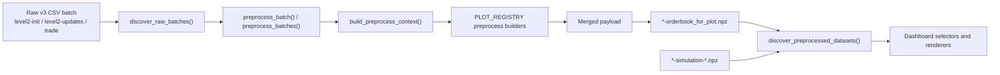

# Preprocess Documentation

`src/preprocess/` is the non-UI layer that turns a raw `v3` CSV batch into a dashboard-ready `.npz` dataset, and also provides catalog/discovery helpers for both preprocessed orderbook files and simulation outputs.

This directory documents the current implementation in the repo as of the refactored `gui/` dashboard. It does not describe the older `gui/plot.py` or `src/preprocess/catalog.py` layout that may still appear in older notes.

## Scope

The package currently has four responsibilities:

1. Discover raw CSV batches and preprocessed `.npz` datasets.
2. Parse and normalize preprocess and simulation filename conventions.
3. Build in-memory preprocess payloads from raw CSV files.
4. Write merged preprocess results back to `data/preprocessed/` in a format the dashboard can load.

## Current module map

- `src/preprocess/__init__.py`
  - Stable public API surface.
- `src/preprocess/models.py`
  - Dataclasses used across discovery, rendering, and preprocessing.
- `src/preprocess/datasets.py`
  - Filename parsing, dataset discovery, simulation matching, and `.npz` loading/validation.
- `src/preprocess/service.py`
  - Preprocess orchestration, CSV loading, builder execution, payload merge, and output writing.
- `src/preprocess/orderbook.py`
  - Orderbook-specific payload builder.
- `src/preprocess/exceptions.py`
  - Package-specific exception hierarchy.

## End-to-end flow

## Where it is used

- `gui/catalog.py`
  - Uses discovery helpers to build product, timestamp, and simulation-group selectors.
- `gui/actions.py`
  - Uses `preprocess_batches()` when the user clicks preprocess in the dashboard.
- `gui/rendering.py`
  - Converts `PreprocessedDataset` to `PlotDatasetLocator` before plot rendering.
- `src/plots/*`
  - Read orderbook/trade payloads or match simulation files during rendering.

## Main concepts

### Raw batch

A raw batch is a complete triple of:

- `level2-<product>-init-<timestamp>.csv`
- `level2-<product>-updates-<timestamp>.csv`
- `trade-<product>-<timestamp>.csv`

These three files are grouped into one `RawBatch`.

### Preprocessed dataset

A preprocessed dataset is an orderbook-oriented `.npz` file:

- `<product>-<timestamp>-<time_step>-orderbook_for_plot.npz`

It may also be associated with zero or more simulation files:

- `<product>-<timestamp>-<time_step>-simulation-<algorithm>.npz`
- `<product>-<timestamp>-<time_step>-resolved-<resolved_time>-simulation-<algorithm>.npz`

The dashboard treats simulation-backed datasets as `PreprocessedDataset` entries too, with `simulation_path` populated.

## Public API summary

Import stable names from `src.preprocess`:

- Models
  - `RawBatch`
  - `PreprocessedDataset`
  - `PlotDatasetLocator`
  - `PreprocessContext`
- Discovery and filename helpers
  - `discover_raw_batches()`
  - `discover_preprocessed_datasets()`
  - `find_simulation_files()`
  - `has_simulation_file()`
  - `format_time_step()`
  - `parse_timestamp()`
  - `load_preprocessed_payload()`
- Services
  - `DEFAULT_TIME_STEP`
  - `preprocess_batch()`
  - `preprocess_batches()`
- Exceptions
  - `PreprocessError`
  - `PreprocessValidationError`
  - `PreprocessOutputConflictError`
  - `PreprocessedDataError`
  - `PreprocessedDataFileError`
  - `PreprocessedDataSchemaError`

## Notes and constraints

- `preprocess_batch()` does not hardcode plot types. It pulls preprocess builders from `src.plots.registry.PLOT_REGISTRY`.
- The current package only writes one `.npz` file per raw batch/time step. Multiple plot types share that file through merged payload keys.
- Simulation data is not produced by `src/preprocess/`; it is only discovered and attached to datasets by filename matching.
- `discover_raw_batches()` marks a raw batch as already preprocessed if any matching orderbook `.npz` exists for the same `(product_id, timestamp)`.
- `load_preprocessed_payload()` validates the orderbook schema before returning payload data.

## Documents in this folder

- `module-reference.md`
  - Module-by-module behavior and public API details.
- `formats-and-contracts.md`
  - Filename rules, `.npz` schema, and builder contracts.
